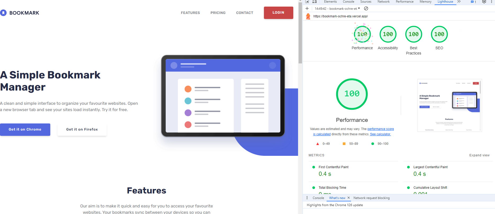

<h3 align="center"> Bookmark - clean and simple bookmark manager </h3>

## Project Overview 🎨

Bookmark - clean and simple bookmark manager.

Install our product on your web browser and manage your tasks in a professional way.

<strong>Be carefull - We require appropriate browser versions!</strong>

For more information, please visit our FAQ section

## Tech/framework used 🧰

| Tech                                                                                                                                              | Description |
| ------------------------------------------------------------------------------------------------------------------------------------------------- | ----------- |
|                                          | Structure   |
|                                    | Styling     |
|                           | Logic       |
|                          | Validation       |
|  | IDE         |
|  | Package Manager         |

## How to install 🎨

```npm
  1. npm install (Install all packages.)
  2. npm run dev (Start to compile project and setup localhost)
  3. Click provided link by localhost.
```

## Live 📍

[https://ktcotz.github.io/Bookmark/](https://ktcotz.github.io/Bookmark/)
